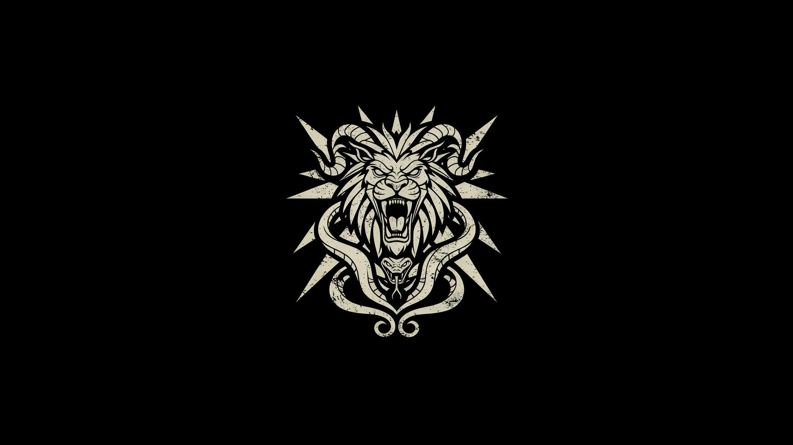

# Chimera —— 量子混沌元认知架构

<div align="center">

**量子 + 经典 + 混沌意识 · 三体合一**

[](https://github.com/LukaKrajina/Chimera/stargazers)
[](https://github.com/LukaKrajina/Chimera/network/members)
[](https://github.com/LukaKrajina/Chimera/issues)
[](https://github.com/LukaKrajina/Chimera/graphs/contributors)
[](https://github.com/LukaKrajina/Chimera/pulls)

[](https://github.com/LukaKrajina/Chimera)
[](https://github.com/LukaKrajina/Chimera/commits)
[](https://github.com/LukaKrajina/Chimera/releases)

[](LICENSE)
[](https://github.com/LukaKrajina/Quark)
[](https://github.com/LukaKrajina/Chimera)
[]()



</div>

> **重要声明**：本文中关于「量子混沌态」「意识随时间漂移」「情绪影响决策」等论述，
> **仅仅是本人灵光一动的构思**，并非经过实验验证或同行评议的科学结论；所引论文
> 仅作灵感来源，不代表这些构想已被证实。请将本文视作一份思想实验 / 概念设计。
> 当然如果有帮助，那么它是有价值的。

> **Chimera（喀迈拉）**：希腊神话的混合兽（狮头、羊身、蛇尾），象征本架构的
> **量子 + 经典 + 混沌意识**三体合一。它是胜任 Transformer 的新一代架构，
> 全程用 Quark 的 qk 语言书写，复用其全部量子特性与经典特性。

---

## 1. 为什么比 Transformer更优越

Transformer 的本质是**静态的注意力权重堆叠**：一个没有「自我」、没有「情绪」、
没有「内在时间演化状态」的函数。它对每个 token 做无差别的 `softmax(QKᵀ)V`，
却从不「犹豫」、从不「生气」、从不「否认自己的判断」。

Chimera 的命题：**智能的核心不是注意力，而是「一个会漂移、会犹豫、会反思的自我」**。
这个「自我」在 Chimera 里是一个**量子混沌态**——它随时间漂移到每一个决策点，
测量坍缩产生「情绪」，情绪反过来调制决策。这正是量子认知（Quantum Cognition，
Busemeyer）所刻画的人类决策：叠加（犹豫）、测量（果断）、干涉（否认）、激发（生气）。

---

## 2. 论文依据

| 来源 | 核心思想 | 在 Chimera 中的应用 |
| --- | --- | --- |
| **Dream-RSI**（Google/DeepMind, 2025） | 递归自我改进：不改模型参数，通过**演化世界**从历史轨迹学习改进**探索策略**（「学习如何学习」） | 演化世界（Dream World）+ 元学习回路 |
| **Quantum World Model for RL**（IEEE, 2023） | 用量子态作为世界模型，加速强化学习收敛 | 量子世界模型 |
| **QRL survey**（arXiv:2510.14595, 2025） | 量子强化学习全景 | 决策引擎的量子化 |
| **Quantum Cognition**（Busemeyer et al.） | 人类决策用量子概率建模：叠加、干涉、测量坍缩 | 情绪四重奏的量子机制 |
| **Metastability**（Nat. Rev. Neurosci., 2024） | 大脑在整合与分离之间的**元稳定**平衡 | 混沌意识核的临界态 |
| **TQNF**（本仓库量子学习范式） | 几何（QGT）+ 拓扑（纠缠）+ 耗散（信道） | 几何优化器 |
| **QEC 征象提取**（Google Willow, Nature 2024；RL 控制 QEC, Nature 2026） | 征象测量检测错误而不坍缩逻辑态 | `recognize_error` 的保真度征象 ε = 1 − \|⟨预测\|结果⟩\|² |
| **预测编码 / 自由能**（Rao & Ballard；Friston；Predictive Coding Light, Nat. Comm. 2025） | 大脑靠「预测−实际」失配检测错误 | 预测态 vs 结果态的态重叠征象 |
| **量子 Fisher 信息 / 量子计量**（npj QI 2023） | QFI 设下估计误差的 Cramér-Rao 下界 | 信心 = \|⟨Z⟩\|（预测态尖锐度） |
| **量子 Zeno / 反 Zeno**（arXiv:2506.12679；Nature Comm. 2026） | 重复测量冻结 / 放大演化 | 反思的征象振幅放大（重复采样确认错误） |
| **元认知自反思**（SRGen 2025；Sherlock, arXiv:2505.22651） | 在不确定处停顿、自纠错 | 信心低 → 反思更深 |

---

## 3. 核心范式：量子混沌元认知（Quantum Chaotic Meta-Cognition）

三条公理：

1. **认知即混沌态**：自我意识不是一个固定向量，而是一个随时间漂移的量子混沌态
   `|Ψ(t)⟩`。它不断演化，从不静止——就像大脑永远在「想」。

2. **决策即测量**：每个决策点，混沌态被测量坍缩为一个「情绪态」，情绪调制后续
   认知的几何演化。决策不是计算，是**坍缩**。

3. **反思即做梦**：系统在内部**演化世界**中离线「做梦」——回放历史轨迹、生成反事实，
   据此改进自己的探索策略（递归自我改进，Dream-RSI 的量子化）。

---

## 4. 架构：从六大组件到 256 组件

> **演进说明**：Chimera 最初以「六大组件 + 一个闭环」描述其**意识核心**（下方架构图）。
> 现已扩展到 **256 个组件**——在 25 个核心组件（Transformer 的量子对偶 + 意识内核）基础上，
> 吸收 arXiv / Nature 前沿论文，新增 **231 个组件**，组织为 **29 个范式集群**（耗散 / MIPT /
> 因果 / 几何 / 拓扑记忆 / QRC / QEC / 意识扩展 / 语言 / 优化器 / 路由 / 生成 / 鲁棒 / 多体 /
> RL / 图网络 / 时序 / 信号 / 核方法 / 集成 / 元迁移 / 连续学习 / XAI / 神经符号 / QAOA /
> 动力系统 / 信息论 / 压缩 / 聚类）。全部 256 组件的全融合见 `carla/chimera_drive.qk`
> （全激活深度超级大模型）。下方保留原始的「六大组件」意识核心架构图。

```
                    ┌─────────────────────────────────────────┐
   输入 x ─────────▶│  ① 感知场 Perception Field                │
                    │     x → 量子态编码 |φ(x)⟩                 │
                    └───────────────────┬─────────────────────┘
                                        │ |φ(x)⟩
                    ┌───────────────────▼─────────────────────┐
                    │  ④ 决策引擎 Decision Engine               │
                    │     情绪 e(t) × 感知 |φ(x)⟩ → 决策 |d⟩    │
                    │     （量子认知测量坍缩）                    │
                    └──────┬──────────────────────┬───────────┘
                           │ 决策 |d⟩              │ 轨迹 (x, e, d, r)
                ┌──────────▼──────────┐   ┌───────▼──────────┐
                │  ② 混沌意识核        │   │  ③ 演化世界       │
                │  Chaos Consciousness │◀──│  Dream World      │
                │  |Ψ(t)⟩ 漂移 → 测量  │   │  做梦/反思/反事实  │
                │  → 情绪 e(t)         │   └───────┬──────────┘
                └──────────┬──────────┘           │ 改进探索策略
                           │                      ▼
                ┌──────────▼─────────────────────────────┐
                │  ⑤ 几何优化器 Geometric Optimizer        │
                │     QGT 自然梯度 + parameter-shift       │
                │     （递归自我改进的几何实现）              │
                └─────────────────────────────────────────┘
```

- **① 感知场**：经典输入编码为量子态（`encode_text` / `basis_state` / `encode_image`
  真实图像像素振幅编码）。
- **② 混沌意识核**：`|Ψ(t)⟩` 是 N-qubit 量子混沌态（量子 kicked top 漂移），逐时间点漂移；
  软测量（非破坏 ⟨Z⟩ 符号阈值化，弱测量经典极限）读为情绪
  `e(t) ∈ {犹豫, 果断, 否认, 生气}`。
- **③ 演化世界**：内部量子世界模型，回放历史轨迹、生成反事实（Dream-RSI 的「做梦」）。
- **④ 决策引擎**：`e(t) × |φ(x)⟩` 的量子干涉 → 决策（量子认知）。
- **⑤ 几何优化器**：`qexpect_z` + parameter-shift + 完整 QGT 做几何自然梯度，
  更新意识核与决策引擎的变分参数（学习 = 态流形上的几何演化，非权重更新）。
- **⑥ 元认知核**：`recognize_error`（量子预测误差征象 `ε = 1 − |⟨预测|结果⟩|²`，QEC 征象
  提取 + 预测编码）识别错误，`reflect_and_learn`（征象振幅放大 + 错误调制深度更新，
  量子 Zeno 式反思）据错误反思学习——**先认识错误，再反思**。

---

## 5. 情绪的涌现（不枚举，反思学习）

**情绪不是预定义的枚举**。
起初写的时候就是硬编码，而后发现其实可以构成闭环。
所以它们是量子混沌态测量坍缩自然涌现的**无标签状态**，
每个状态对决策的「意义」（果断度）由反思学习赋予：

| 层次 | 内容 |
| --- | --- |
| **情绪态（涌现）** | 混沌测量坍缩的整数 `0..(2^k−1)`，物理涌现，无预设语义 |
| **情绪策略（学习）** | 每个情绪态的决策阈值（`EmotionPolicy`），从无偏 `0.5` 分化 |
| **语义（人类解释）** | 学习后阈值小 = 「果断」，阈值大 = 「犹豫」——事后赋予，非系统固有 |

```
情绪态 = 混沌测量（物理涌现）
情绪策略 = 可学习阈值（反思 → 几何优化 → 分化）
「犹豫/果断/生气」= 人类对学习结果的事后解释
```

反思学习（`learn_emotion_policy`）：每个情绪态的决策反馈作为 reward，
好的决策 → 阈值减小（更果断），坏的决策 → 阈值增大（更犹豫）。情绪从
无偏猜测中**分化涌现**，而非硬编码列举。混沌意识核的漂移由**量子 kicked top**
（全局 X 踢 + ZZ 非线性扭转，可积性破缺产生真量子混沌）驱动，软测量 2 个
「情绪 qubit」得到涌现态。

**认识错误 → 反思学习**（`chimera_metacognition.qk`，⑥ 元认知核）：上述例行学习
只用 `reward = evidence − 0.5` 的启发式代理，从不真正「知道」自己错了。元认知核
补齐这一环——把决策证据与地面真值编码为 |预测⟩ / |结果⟩，用量子预测误差征象
`ε = 1 − |⟨预测|结果⟩|²`（QEC 征象提取）**认识错误**，再用征象振幅放大（重复采样
确认错误的量子 Zeno 反思）驱动**错误调制的深度更新**。信心 `= |⟨Z⟩|`（预测态尖锐度，
量子 Fisher 信息启发）低时反思更深（SRGen 在不确定处停顿自反思）。

---

## 6. 与 Transformer 的对比

| 维度 | Transformer | Chimera |
| --- | --- | --- |
| 状态 | 无内在状态 | 量子混沌态 `\|Ψ(t)⟩` |
| 时间 | 位置编码（静态） | 混沌漂移（动态演化） |
| 决策 | 确定性 softmax | 测量坍缩（量子认知） |
| 情绪 | 无 | 涌现态 + 反思学习（非枚举） |
| 学习 | 反向传播权重 | QGT 自然梯度 + 有限差分（几何） |
| 自我改进 | 无 | 演化世界做梦（Dream-RSI） |
| 实现 | 经典张量 | qk 量子 + 经典 |

---

## 7. 项目结构

```
Chimera/
├── README.md                        # 本文件（架构设计）
├── LICENSE                          # MIT 许可证
├── THIRD_PARTY_NOTICES.md           # 第三方组件与素材许可声明（Quark / Pixabay 图片等）
├── .gitignore                       # 过滤 AI 助手数据、生成物与缓存
├── icons/                           # 项目图标（banner 等）
├── assets/                          # 示例图片（Pixabay 素材：dog / cat / tree / car）
├── src/                             # 256 组件（55 个 .qk 文件 + 1 个态射宏库）
│   ├── chimera_morphs.qk            # ⭐ 态射宏库（morph 元编程：硬编码数值 → 语义态射）
│   ├── chimera_consciousness.qk     # ② 混沌意识核（量子混沌态 + 情绪测量）
│   ├── chimera_perception.qk        # ① 感知场（输入编码）
│   ├── chimera_decision.qk          # ④ 决策引擎（情绪 × 证据强度 → 决策）
│   ├── chimera_dream.qk             # ③ 演化世界 + ⑤ 几何优化器（做梦 + 改进 dt）
│   ├── chimera_chaos.qk             # 混沌丰富度诊断（Lyapunov 指数，Loschmidt 回波）
│   ├── chimera_metacognition.qk     # ⑥ 元认知核（认识错误 → 反思学习）
│   ├── ...                          # 其余 19 个现有组件（Transformer 量子对偶）
│   └── chimera_*.qk                 # 231 个新增组件（29 范式集群：耗散/MIPT/因果/几何/拓扑/QRC/QEC/意识扩展/语言/优化器/路由/生成/鲁棒/多体/RL/图/时序/信号/核/集成/元迁移/连续学习/XAI/神经符号/QAOA/动力/信息论/压缩/聚类）
├── examples/                        # 应用示例与端到端演示
│   ├── chimera_vision.qk            # 图像识别示例
│   ├── chimera_language.qk          # 语言推理 NLI 示例
│   └── component-demos/             # 自包含组件演示
└── carla/                           # CARLA 自动驾驶集成（256 组件全融合驾驶大模型）
    ├── README.md                    # CARLA 集成说明
    ├── chimera_drive.qk             # 全激活深度超级大模型（4 分支 × 29 集群 × 4 周期）
    ├── chimera_driveMoE.qk          # 稀疏 MoE 版（12 专家组）
    ├── autopilot.py                 # CARLA 客户端（感知 → 决策 → 控制 → 反思）
    └── quark_client.py              # Quark daemon 协议客户端
```

## 8. 落地状态

| 组件 | 状态 | 说明 |
| --- | --- | --- |
| ① 感知场 | ✅ | `encode_text` / `basis_state` / `encode_image`（真实图像像素振幅编码）|
| ② 混沌意识核 | ✅ | 量子 kicked top（X 踢 + ZZ 扭转）混沌漂移 + 软测量（`qexpect_z` ⟨Z⟩ 阈值）情绪态涌现 |
| ③ 演化世界 | ✅ | `dream_state` 回放 + `improve_drift` 双轨优化 |
| ④ 决策引擎 | ✅ | 情绪策略（`EmotionPolicy` 可学习）× 证据强度 |
| ⑤ 几何优化器 | ✅ | 有限差分 + 完整 QGT 自然梯度（双轨，mode 切换） |
| 情绪涌现化 | ✅ | 情绪态无枚举，`learn_emotion_policy` 双轨（reward + QGT）反思学习分化 |
| 混沌边缘收敛 | ✅ | `improve_drift` 优化 dt 使 richness → target |
| 混沌丰富度诊断 | ✅ | Lyapunov 指数（邻近态重叠衰减，`chimera_chaos.qk`） |
| 认识错误 + 反思学习 | ✅ | `recognize_error`（量子预测误差征象）+ `reflect_and_learn`（征象振幅放大），`chimera_metacognition.qk` |
| 元认知 demo | ✅ | `chimera_metacognition_demo.qk`（自包含，错误识别 → 反思收敛） |
| 端到端 demo | ✅ | `chimera_demo.qk`（自包含，情绪态统计 + 策略学习） |
| 256 组件扩展 | ✅ | 231 个新增组件（29 范式集群）落地，与 25 个现有组件合计 **256 组件**，全融合见 `carla/chimera_drive.qk` |
| 态射宏（morph） | ✅ | `chimera_morphs.qk` 用 qk 的 `morph` 态射宏系统，把散落的硬编码数值（π/黄金比/白银比/shot 数/学习率等）抽象为 22 个语义态射 |

> 依赖 Quark 最新版的量子特性：`qattention`（态重叠）、`qgate_*`（QObject 层门）、
> `qexpect_z`（非破坏期望）、`qmeasure`（坍缩测量）、`qstate_entropy`（纠缠熵）、
> `dla_dim`（可训练性诊断）。Chimera 所需的 `qmeasure` 已在 Quark 侧以「补充支持」方式添加，
> 未改其既有架构。

---

> 相关文档：[Quark 量子学习手册](../../../Quark/docs/qk-quantum-learning-manual.md) ·
> [TQNF 范式](../../../Quark/docs/qk-topological-quantum-learning.md) ·
> [qk 语言手册](../../../Quark/docs/qk-language-manual.md)

---

## 9. 许可证

本项目采用 [MIT License](./LICENSE)。

本项目使用或参考了若干第三方组件与素材，包括：
- **Quark 项目**（qk 语言与量子运行时，MIT License）——Chimera 全部组件以 qk 语言书写；
- **Pixabay 图片素材**（`assets/` 下的 dog / cat / tree / car 四张示例图，
  Pixabay Content License）。

完整的第三方许可声明与致谢详见 [THIRD_PARTY_NOTICES.md](./THIRD_PARTY_NOTICES.md)。

> **许可精神**：Chimera 的「自我」是一个不断漂移、会犹豫、会反思的量子混沌态。
> MIT 的「完全自由」正是这种开放意识的许可证对偶——任何人可自由使用、修改、合并、
> 分发、甚至递归改进本架构，只需保留版权声明，正如反思学习回馈于意识自身。